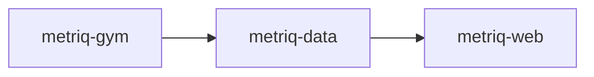

# Metriq Platform

This repository is the umbrella for Metriq platform architecture and cross-component documentation.

## Architecture Overview

## Components

| Repository | Purpose | License |
| --- | --- | --- |
| [unitaryfoundation/metriq-gym](https://github.com/unitaryfoundation/metriq-gym) | Benchmark protocol definitions and execution tooling | Apache-2.0 |
| [unitaryfoundation/metriq-data](https://github.com/unitaryfoundation/metriq-data) | Versioned, schema-enforced benchmark datasets | CC-BY-4.0 |
| [unitaryfoundation/metriq-web](https://github.com/unitaryfoundation/metriq-web) | Metrics dashboards, raw-data tables, and detailed views | Apache-2.0 |

## Issues

Please report issues in the relevant component repository. If you're unsure which one is correct, open the issue here and it will be triaged.

## Roadmap

For a detailed roadmap of the Metriq platform, please refer to the [Wiki page](https://github.com/unitaryfoundation/metriq/wiki/Metriq-Platform#roadmap).
